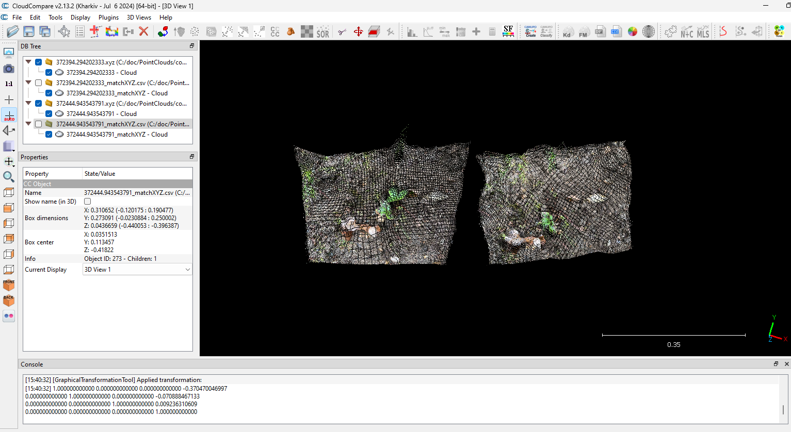

# Merge Point Cloud

These scripts provide a function to automatically merge a point cloud with another point cloud that shares the same background.

  

Although some applications offer auto-merge functions, it does not cover the case that the shapes of the two models are physically different, which requires manual adjustment.

These scripts are designed for users of [the app](https://github.com/Shin-1980/PointCloudGenerator) to capture trends in changing objects, such as plant growth.

## Methodology

This approach is based on the fact that extracting features from two-dimensional images is easier than from three-dimensional models, as 2D images are denser and less noisy, whereas 3D models tend to be sparse and noisier.

This script uses the BFMatcher() function to match features between two images. The BFMatcher() effectively disregards differences between objects, focusing on extracting features from the background.

  

This script computes a set of three-dimensional coordinates by extracting and utilizing features from 2D images. Then, the transformation matrix is determined by minimizing the mean squared error between corresponding 3D points.

  

